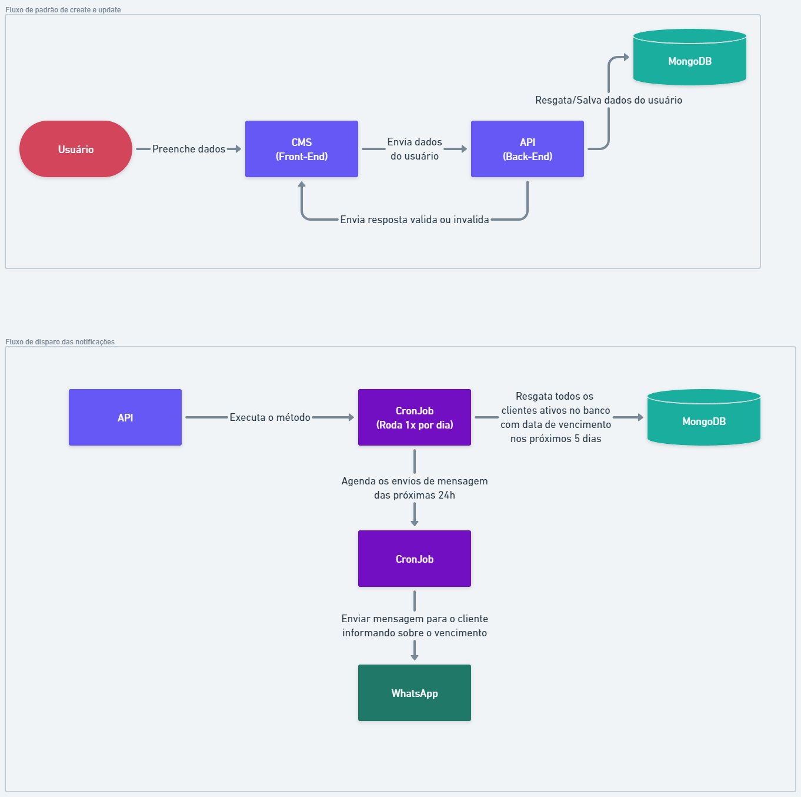

# ClickDigital

plataforma para gestão de clientes + bot whatsapp

<p align="center">
  <a href="http://nestjs.com/" target="blank"></a>
</p>

[circleci-image]: https://img.shields.io/circleci/build/github/nestjs/nest/master?token=abc123def456
[circleci-url]: https://circleci.com/gh/nestjs/nest

  <p align="center">A progressive <a href="http://nodejs.org" target="_blank">Node.js</a> framework for building efficient and scalable server-side applications.</p>
    <p align="center">
<a href="https://www.npmjs.com/~nestjscore" target="_blank"></a>
<a href="https://www.npmjs.com/~nestjscore" target="_blank"></a>
<a href="https://www.npmjs.com/~nestjscore" target="_blank"></a>
<a href="https://circleci.com/gh/nestjs/nest" target="_blank"></a>
<a href="https://coveralls.io/github/nestjs/nest?branch=master" target="_blank"></a>
<a href="https://discord.gg/G7Qnnhy" target="_blank"></a>
<a href="https://opencollective.com/nest#backer" target="_blank"></a>
<a href="https://opencollective.com/nest#sponsor" target="_blank"></a>
  <a href="https://paypal.me/kamilmysliwiec" target="_blank"></a>
    <a href="https://opencollective.com/nest#sponsor"  target="_blank"></a>
  <a href="https://twitter.com/nestframework" target="_blank"></a>
</p>
  <!--[](https://opencollective.com/nest#backer)
  [](https://opencollective.com/nest#sponsor)-->

## Description

[Nest](https://github.com/nestjs/nest) framework TypeScript starter repository.

## Installation

```bash
$ yarn install
```

## Running the app

```bash
# development
$ yarn run start

# watch mode
$ yarn run start:dev

# production mode
$ yarn run start:prod
```

## Test

```bash
# unit tests
$ yarn run test

# e2e tests
$ yarn run test:e2e

# test coverage
$ yarn run test:cov
```

## License

Nest is [MIT licensed](LICENSE).

# Arquitetura

## Definições (Técnologias)

Backend: NodeJs + NestJS
Banco de dados: MongoDB
Frontend: React + HorizonUI
Arquiterura: Monolito
Deploy: Docker + Compose
Hospedagem: AWS
WhatsApp: https://github.com/open-wa/wa-automate-nodejs

## Etapas do projeto

`OK` 1 - Coletar todas as informações sobre funcionalidades e fluxos do sistema

`OK` 2 - Desenhar a arquitetura do sistema

3 - Desenvolver a API (backend) + integração com banco de dados

4 - Realizar deploy da API em homologação

5 - Desenvolver telas do frontend

6 - Integrar telas do frontend com API em homologação

7 - Realizar deploy do CMS em homologação

8 - Testar todos os fluxos do sistema

## Funcionalidades

OK - CRUD de usuário

OK - Autenticação JWT

OK - CRUD de serviços

- CRUD de planos
- CRUD de clientes que receberão avisos de expiração do seu plano/produto

- Realizar conexão com o whatsapp e salvar os cookies da conexão
- Enviar mensagens automaticas baseados nas configurações e salva-las no banco
- Criar chaves de referencia para informações dos clientes

## Entidades

- Global params:

```
{
      createAt: Date
      updateAt: Date
      deleted: boolean
}
```

- Customer:

```
{
    name: string
    whatsapp: string
    login: string
    password: string
    serviceId: Service
    planId: Plan
    userId: string
    invoice: string
    validateDate: Date
    pushNotification: {
        5DaysBefore: {
            active: boolean
            sended: boolean
        }
        3DaysBefore: {
            active: boolean
            sended: boolean
        }
        1DayBefore: {
            active: boolean
            sended: boolean
        }
        EndDay: {
            active: boolean
            sended: boolean
        }
        1DayAfter: {
            active: boolean
            sended: boolean
        }
    }
    comments: string
}
```

- Service:

```
{
    name: string
    cost: Decimal128
    userId: string
}
```

- Plan:

```
{
    name: string
    value: Decimal128
    userId: string
}
```

- User:

```
{
    name: string
    password: string
    whatsapp: string
    email: string
    company: string
}
```

- Message:

```
{
    content: string
    seasonId: Season
    customerId: Customer
}
```

- MessageConfigs:

```
{
    5DaysBefore: {
        active: boolean
        message: string
    }
    3DaysBefore: {
        active: boolean
        message: string
    }
    1DayBefore: {
        active: boolean
        message: string
    }
    EndDay: {
        active: boolean
        message: string
    }
    1DayAfter: {
        active: boolean
        message: string
    }
}
```

- Season:

```
{
    picture: string
    name: string
    whatsappId: string
}
```

## Desenhos de arquitetura


